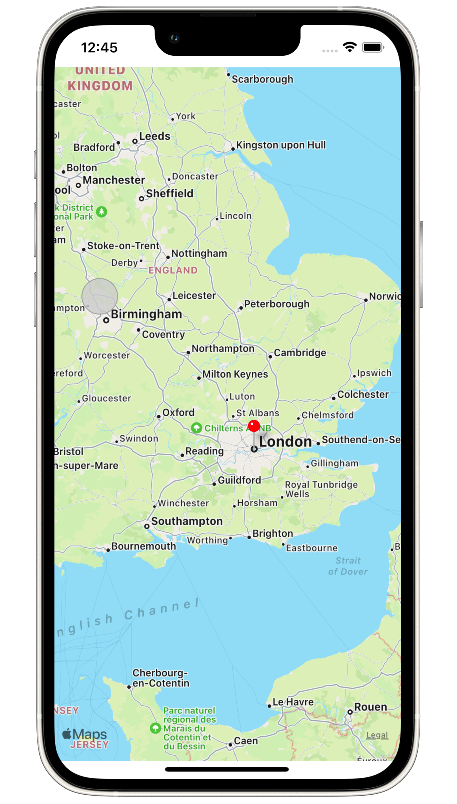
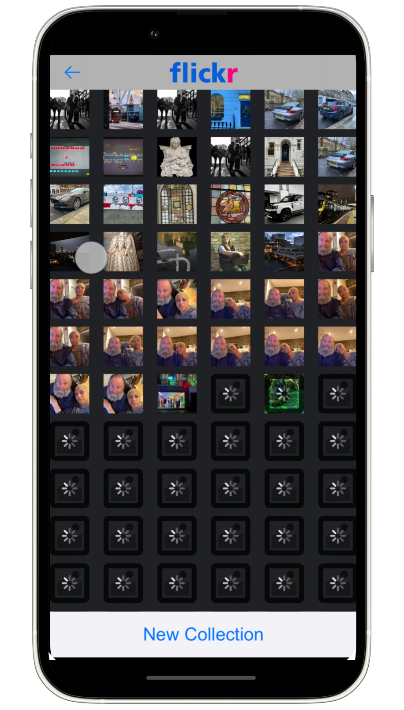
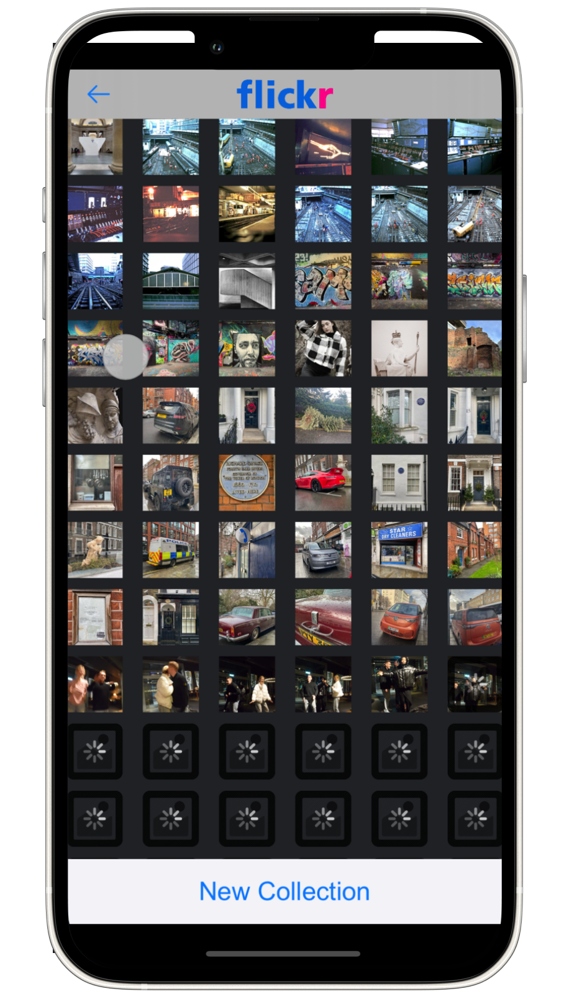

# Virtual Tourist

Virtual Tourist is a Flickr client application that allows users to tour the world from the comfort of their homes. The user can place a pin anywhere on the map. Clicking that pin reveals potentially thousands of pictures that have been shared by Flickr users at that location.

Virtual tourist is a project which significantly deepened my understanding of foundational iOS development skills. In particular, the goal was to learn how to manage intensive network requests asynchronously and simultaneously store and retrieve data from User Defaults and Core Data, all while maintaining a seamless user experience. This was accomplished through a complex interplay of GCD queues (both serial and concurrent) to group related processes, and closures to respond appropriately to events when they occurred.

  

# Implementation

Following MVC architecture, the app consists of two main parts: the model and the view controllers. 

The model consists of the **Flickr client**, which uses GET requests to retrieve image data for a selected location, and the **Core Data database**, which allows allows Flickr data which has previously been downloaded to be stored within the app to reduce the load on the network.

The view controllers are the LocationsMapVC, which handles maps and pins, and the PhotoAlbumVC, which handles the images and network requests.

**LocationsMapVC** uses the MapKit framework to generate maps and pins. Pins are represented in code as longitudinal and latitudinal locations called "annotations." When a user holds their finger at a location, long guesture recognizers are used to record the latitudinal and longitudinal data of that location. The annotations are immediately displayed as MKPointAnnotations (pins on the map) and saved to Core Data. If the user selects a pin that already exists, then a request for the images associated with that location is sent to Core Data. If the images exist in Core Data, then they are passed to a PhotoAlbumVC instance which is presented immediately.

**PhotoAlbumVC** will behave in one of two ways. If image data is received from LocationsMapVC, it will display those images immediately. However, if this is the first time the pin has been loaded, there will be no images in Core Data. In either case, a count of the number of images expected is passed to the view controller before it loads. On the first load, that number of images will be filled with placeholder images and a fetch request will be made for the Flickr images at that location. The downloaded images replace the placeholder images at the moment that they are received and processed by the app. This creates a seamless animation where images quickly fill in right in front of the user's eyes.

# Libraries and Frameworks
* UIKit
* CoreData
* MapKit

# Installation
Download the zip folder and open the file "VirtualTourist V2.xcodeproj" in Xcode.

# License
All code is original and was written by me. The project was developed as part of the iOS Developer Nanodegree Program, in accordance with the project rubric.
